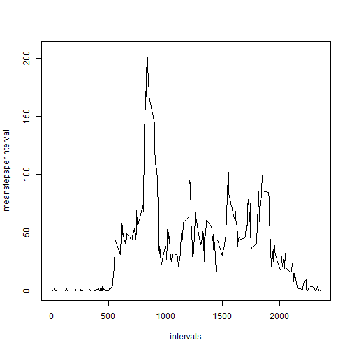

# Reproducible Research: Peer Assessment 1
<br>
## Introduction
In this assignment we will use data from a personal activity monitoring device to perform a brief exploratory analysis. The device collects data continuosly at 5 minute intervals throughout the day. The data consists of measurements of the number of steps taken in 5 minute intervals collected during a two month period from an anonymous individual.

## Data
The data set is stored in a comma-separated-value file and contains a total of 17,568 observations.

The variables included in the data set are:

- steps: number of steps taken in a 5 minute interval (missing values are coded as NA)
- date: the date in which the measurement was taken in YYYY-MM-DD format
- interval: identifier for the 5 minute interval in which the measurement was taken

## Loading and preprocessing the data
Assuming the data file is in the working directory, we load the data as is without any preprocessing at this stage.


```r
activity <- read.csv('activity.csv')
```


## What is mean total number of steps taken per day?
We would like to know the average number of total steps taken per day. First, we take a look at the distribution of total steps taken per day. In the figure we can see that the distribution is approximately normal.

```r
totaldailysteps<-tapply(activity$steps,activity$date,sum)
hist(totaldailysteps)
```

 

Ignoring missing values, the mean total number of steps taken per day is 10,766 and the median is 10,765, we can see that the values are almost equal.

```r
mean(totaldailysteps,na.rm=TRUE)
```

```
## [1] 10766.19
```

```r
median(totaldailysteps,na.rm = TRUE)
```

```
## [1] 10765
```

## What is the average daily activity pattern?
Next, we would like to know what is the average daily activity pattern. In order to obtain the pattern we first remove missing values from the dataset. With the new dataset we can calculate the average number of steps in any given interval via the 'tapply' function which allows to omit a loop-structure.
We can obtain a few insights from this plot. First, as it would be expected, we can observe that the individual is sleeping through the night as the avearge number of steps is very low. We can also identify a burst of activity between the 500 and 1000 intervals.

```r
activityNoNa <- subset(activity, !is.na(steps))
intervals <- unique(activityNoNa$interval)
meanstepsperinterval<-tapply(activityNoNa$steps,activityNoNa$interval,mean)
plot(intervals,meanstepsperinterval,type="l")
```

 

The burst we identified in the previous plot also contains the maximum number of steps on average for any 5 minute interval. We identify which interval contains the maximum number of steps as 835.

```r
indexmax <- which(meanstepsperinterval==max(meanstepsperinterval),arr.ind = TRUE)[1]
intervalmax <- intervals[indexmax]
intervalmax
```

```
## [1] 835
```

## Imputing missing values
In order to reduce possible bias in our previous calculations, we would like to remove the missing values (coded as NA). The total number of missing values in the original dataset is 2304.


```r
TotalNas <- (dim(activity)[1]-dim(activityNoNa)[1])
sum(is.na(activity$steps))
```

```
## [1] 2304
```

We impute the missing value with a very simple strategy, namely, we assign to an interval with a missing value the average number of steps accross all days for that interval. We create a new dataset 'newdata' with the imputed values.


```r
#impute missing values with average of interval
#create new data frame with imputed missing values
activity$meanStepsperInterval<-rep(round(meanstepsperinterval),61)
activity$steps[is.na(activity$steps)] <- 
    activity$meanStepsperInterval[is.na(activity$steps)]
newdata <- subset(activity, select = steps:interval)
```

With the new dataset we construct the histogram of the total number of steps per day. The histogram seems similar to the previous histogram, we can see that there are more cases and so the bins get higher values.


```r
newtotaldailysteps<-tapply(newdata$steps,newdata$date,sum)
hist(newtotaldailysteps)
```

 

The mean number of total steps taken per day is not affected by the data imputation as remains constant at 10,766. However, the median number of total steps for the new dataset is 10,762 which is slightly lower than the median obtained for the dataset with missing values.


```r
mean(newtotaldailysteps)
```

```
## [1] 10765.64
```

```r
median(newtotaldailysteps)
```

```
## [1] 10762
```

## Are there differences in activity patterns between weekdays and weekends?
Finally, we would like to compare activity patterns between weekdays and weekends to see if there are any differences. To do so, we create a categorical variable 'wday' that indicates whether a given day is a 'weekday' day or a 'weekend' day.


```r
#create categorical variable
newdata$wday<-weekdays(as.Date(newdata$date))
newdata$wday[newdata$wday=="Sunday" | newdata$wday=="Saturday"]<-"weekend"
newdata$wday[newdata$wday!="weekend"]<-"weekday"
newdata$wday<-as.factor(newdata$wday)
```

With the help of the new categorical variable, it is very easy to create a panel plot via the 'xyplot' function of the lattice library. To obtain the average number of steps per interval, the used the panel function makes it straightforward.

We plot the average number of steps per interval for weekdays and weekends. It is now possible to distinguish different patterns. For instance, the individual gets up later during the weekends, it does not have such a high activity during the intervals around 835 and also is more active throughout the day as compared to the weekdays.


```r
library(lattice)
xyplot(steps ~ interval | wday, data = newdata,       
       layout = c(1,2), type = "l", col="blue",
       xlab="Interval", ylab="Number of steps",
       ylim=c(-15,240), 
       panel = function(x, y, ...) {
           panel.average(x, y, ...,horizontal=FALSE)
           })
```

 

## Summary
New monitoring devices allow the collection of large amount of data about personal movement. With some preprocessing, this data can be analyzed and interpreted. We analyzed data for a single individual collected for two months. The data consists of the total number of steps taken in 5 minute intervals. The original data set had over 10% of missing data, which could bias the results of our analysis. After imputing values with a simple strategy, we can conclude that imputing values in the dataset did not change drastically the summary statistics. The mean value remained the same but the median value was lower with the imputing strategy utilized. With the help of a categorical variable and the lattice package, comparing the average activity patterns of weekdays and weekends is straightforward.
